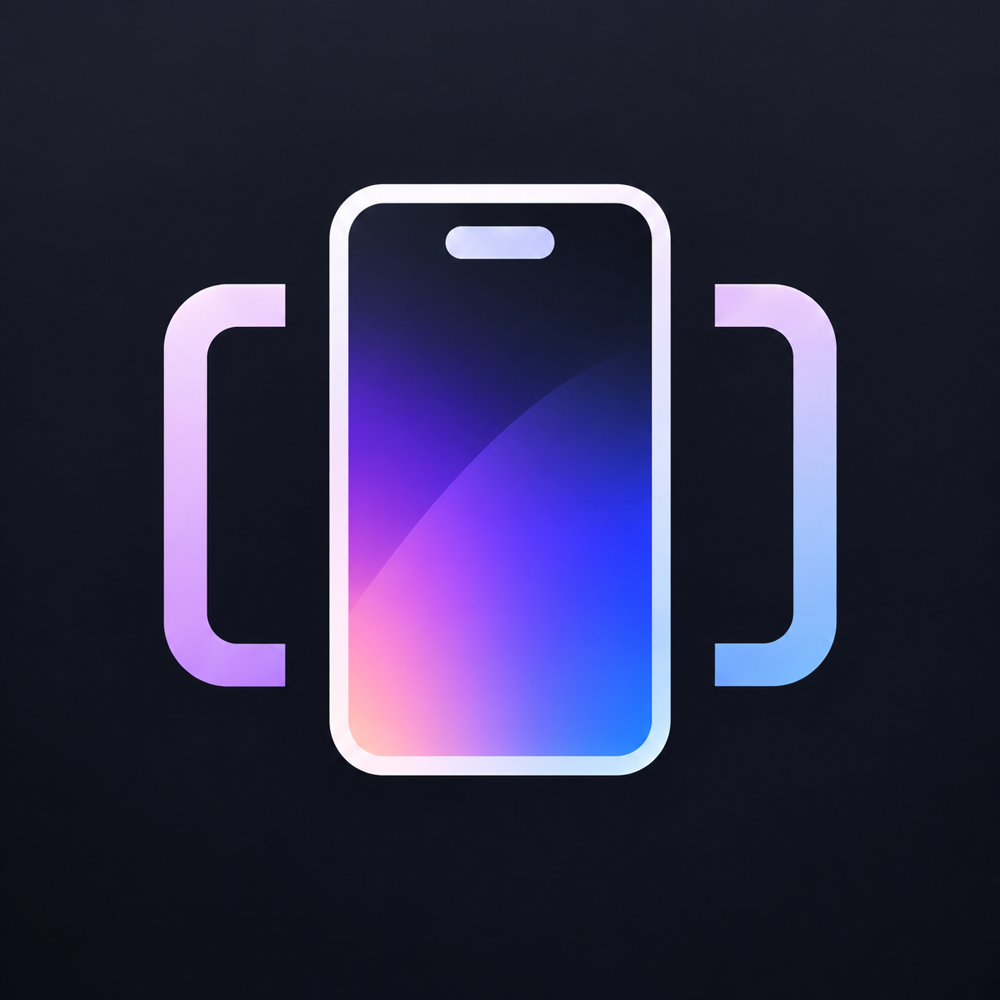
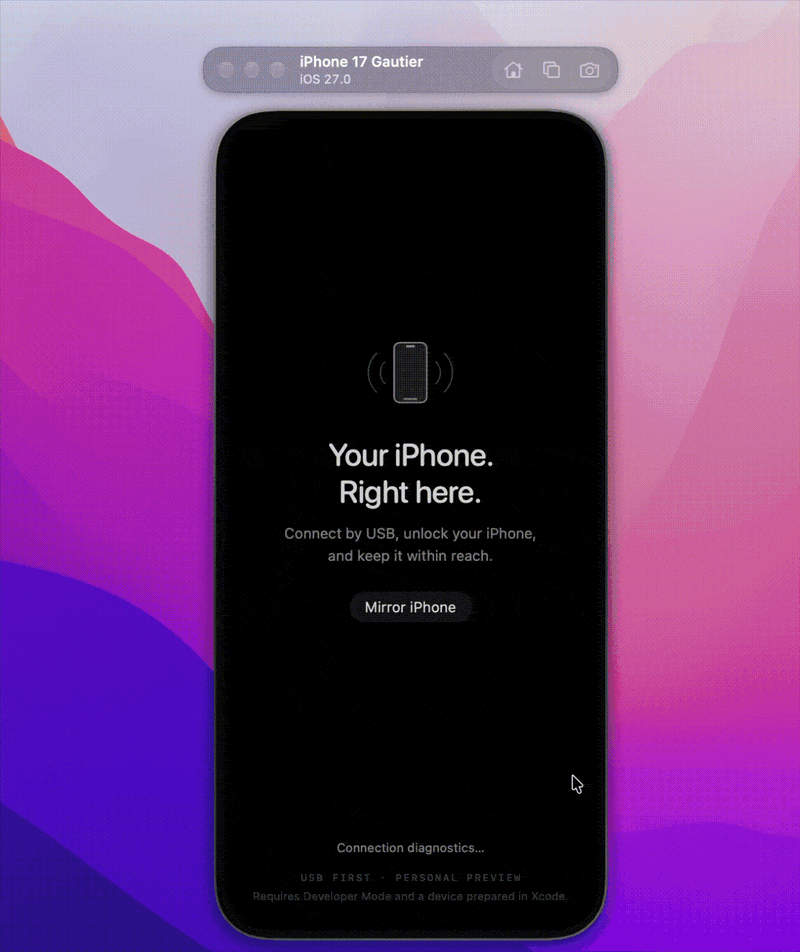

  

# iPhoneMirror

Free, open-source iPhone mirroring and control for Mac, including in the EU.
I built it for myself because other tools didn’t work for me.

**Early preview; USB only.**

  

## Features

- Mouse, keyboard, scrolling and text paste.
- Drag an image from the Mac onto the mirror to paste it into whatever's focused on the iPhone (e.g. an iMessage compose field).
- Screenshots and silent screen recording.
- Audio playback with mute and volume control.
- Remote rotation, Home, App Switcher, Spotlight and Control Center.
- Optional iPhone bezels, Always on Top and automatic reconnection.
- Opt-in local [API and MCP tools](docs/AUTOMATION.md) for AI-agent device testing.

## Setup

- Apple silicon Mac: **macOS 27**. iPhone: **iOS 27**.
- Install [Xcode 27](https://developer.apple.com/xcode/resources/) and complete its initial setup — this is still required even with the downloadable app below, since the iPhone itself needs to be prepared for it.
- Connect by USB, [trust your Mac](https://support.apple.com/en-us/109054), and [pair/prepare the phone in Xcode](https://developer.apple.com/documentation/xcode/running-your-app-on-simulated-or-physical-devices).
- Enable [Developer Mode](https://developer.apple.com/documentation/xcode/enabling-developer-mode-on-a-device).

## Try it

[**Download the latest release**](https://github.com/gdelataillade/phone-mirror/releases/latest), open the DMG, and drag iPhoneMirror to Applications.

The app checks for updates automatically and can check on demand (app menu → Check for Updates…).

Keep your iPhone unlocked, click **Mirror iPhone**, then click the picture to control it.

## AI agents (MCP)

Let Claude Code, Codex or another MCP client see and operate your iPhone to test apps: screenshots, taps, typing, buttons, and launching apps by bundle ID.

1. While mirroring, choose **Automation → Enable Agent Access**.
2. Register the bridge once, from this repository:
   `claude mcp add --scope user iphonemirror -- python3 "$PWD/scripts/iphonemirror_mcp.py"` (or `codex mcp add iphonemirror -- …`)
3. Start a new agent session and ask, e.g. *"Use the iphone tools to open Settings and search for Wi-Fi."*

Details: [MCP bridge](docs/MCP-BRIDGE.md) · [HTTP API](docs/AUTOMATION.md)

[Help & limitations](VALIDATION.md) · [Development](docs/DEVELOPMENT.md) · [MIT license](LICENSE)
